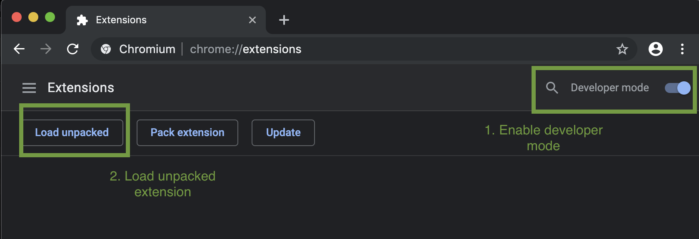
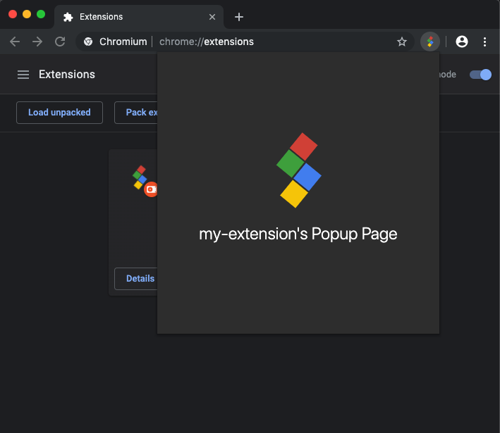

[![MIT License][license-shield]][license-url]

 

  

  <h2 align="center">Chromex</h2>

  

    Fast and easy framework for development of Google Chrome extensions
     
    <a href="#quickstart"><strong>Get started »</strong></a>
     
     
   <a href="https://github.com/bluepropane/create-chrome-extension/issues">Got an issue? Report it here</a>
     
    <a href="https://github.com/bluepropane/create-chrome-extension/issues"> Request features here</a>
  

<!-- TABLE OF CONTENTS -->

**Table of Contents**

- [Features](#features)
- [Prerequisites](#prerequisites)
- [Quickstart](#quickstart)
- [Documentation](#documentation)
    - [1. Tutorial Overview](#1-tutorial-overview)
    - [2. Customizing Extension Pages](#2-customizing-extension-pages)
    - [3. Publishing your extension](#3-publishing-your-extension)
- [Roadmap](#roadmap)
- [Contact](#contact)
- [Contributing](#contributing)
- [Acknowledgements](#acknowledgements)
- [License](#license)

## Features

- Fully working, zero configuration prototype in minutes
- ES6+Webpack development
- Live reloading of extension pages during development
- [Preact](https://preactjs.com) as frontend framework
- CLI tools to generate pages as required for your extension. Currently supports popular use cases:
    - [Browser action popup](https://developer.chrome.com/extensions/browserAction)
    - [Background script](https://developer.chrome.com/extensions/background_pages)
    - [New tab override](https://developer.chrome.com/extensions/override)
    - [Options page](https://developer.chrome.com/extensions/options)
- Auto resizing and generation of icon sizes based on Google Chrome's [manifest requirements](https://developer.chrome.com/extensions/manifest/icons)

## Prerequisites
- Knowledge of javascript is a **must**
- Knowledge of chrome extension development is **good to have** 
- `nodeJS >= 8.9.0`
- `npm >= 5.2.0` (`npx` support)
- `Chrome >= 55`

This project was developed on macOS, so it should work fine on Linux-based systems. You might run into issues developing on Windows as it hasn't been tested yet. In any case, report issues [here!](https://github.com/bluepropane/create-chrome-extension/issues)

## Quickstart
Enough talking, give me my extension!

In this demo, we will create a simple extension with a browser action popup.

**1. Generate the project folder**

     npx @chromex/cli new my-extension && cd my-extension

 This will generate a folder with named `my-extension` in the current working directory. 

**2. Start the development server**
 
 You can use your favourite package manager:

    npm run dev
    OR
    yarn dev

  This command should output some logs to the terminal. After a few seconds you should see a folder named `ext/` created in `my-extension/`. 

**3. Load unpacked extension**

  Navigate to [chrome://extensions](chrome://extensions) on your chrome browser and click on the `Load unpacked` button (If you don't see it, you might have to enable `Developer mode` on the top right corner of the same page first). Select the generated `ext/` folder from your project root as the target extension directory.

  

**4. *Voila!***

  Your extension should appear in the chrome extensions list now, and the extension icon should appear in the extension bar (top right corner of your browser window). Click on it to see the boilerplate popup page. You have just completed setting up your first extension environment!

  

## Documentation

#### [1. Tutorial Overview](https://github.com/bluepropane/create-chrome-extension/blob/master/docs/1-Overview.md)

#### [2. Customizing Extension Pages](docs/2-Extension-Pages.md)

#### [3. Publishing your extension](docs/3-Publishing.md)

<!-- ROADMAP -->
## Roadmap

1.  Support page templates using other frontend frameworks e.g. [React](https://reactjs.org), [Vue](https://vuejs.org) (currently supports only [preact](https://preactjs.com)
2.  More comprehensive documentation
3.  [HMR](https://webpack.js.org/concepts/hot-module-replacement/) Support
4.  Better testing

<!-- CONTACT -->
## Contact

[@bluepropane1](https://twitter.com/bluepropane1) - rbluepropane@gmail.com

Project Link: [https://github.com/bluepropane/create-chrome-extension](https://github.com/bluepropane/create-chrome-extension)

<!-- CONTRIBUTING -->
## Contributing
I started on this project simply because I am interested in chrome extensions. Still active in the process of developing it but can't do everything solo, so any contribution at all is greatly appreciated! You drop me a message, create an [issue](https://github.com/bluepropane/create-chrome-extension/issues) or [pull request](https://github.com/bluepropane/create-chrome-extension/pulls) :)

It doesn't have to fix a problem - it can also be something you have in mind that will make developing chrome extensions more efficient for everyone! 

<!-- ACKNOWLEDGEMENTS -->
## Acknowledgements

* [rubenspgcavalcante's `webpack-extension-reloader`](https://github.com/rubenspgcavalcante/webpack-extension-reloader) for inspiration on live reloading of chrome extensions

<!-- LICENSE -->
## License

Distributed under the GNU General Public License. See [`LICENSE`](LICENSE) for more information.

<!-- MARKDOWN LINKS & IMAGES -->
[license-shield]: https://img.shields.io/badge/License-GPLv3-blue.svg
[license-url]: https://github.com/othneildrew/Best-README-Template/blob/master/LICENSE.txt
[product-screenshot]: images/screenshot.png
